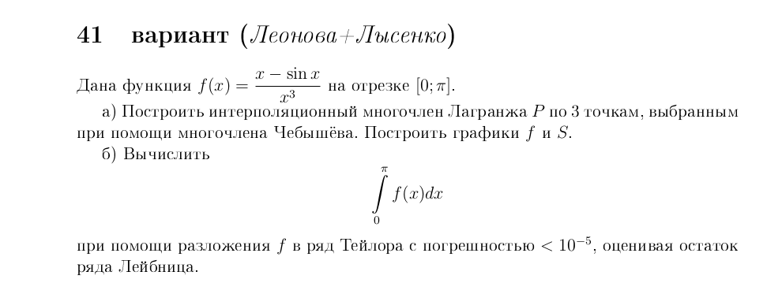

### Лабораторная работа №4, вариант №1

(Задание в файле task.png)

### Зависимости

1. Библиотека [cairo](https://www.cairographics.org/).
    * Для установки следуйте [инструкции](https://www.cairographics.org/download/).

### Запуск

1. Установите компилятор языка D (dmd) ([ссылка](https://dlang.org/download.html#dmd)).
2. Перейдите в каталог с программой.
3. Запустите проект, выполнив команду:

	dub --build=release   #DUB - система автоматической сборки, устанавливается с dmd

### Другие команды
	dmd -unittest #запуск Unit-тестов
	dmd -debug #запуск с отладочными сообщениями
	dmd -D #создание документации в docs/
	
	rdmd #компиляция и запуск; поддерживаются ключи dmd

	dub build #компиляция
	dub --build=release #компиляция и запуск
	dub --build=docs #генерация документации
	dub --build=debug #запуск в режиме отладки с выводом отладочных сообщений
	dub #то же
	dub test #запуск Unit-тестов

### Ссылки:
* Сайт Dlang ([eng](https://dlang.org/), [рус](https://dlang.ru/)).
* [Начало программирования на Dlang](https://github.com/deviator/duseful/blob/master/manuals/begin.md)

### Обратная связь
E-mail: [lysenko765@ya.ru](mailto:lysenko765@ya.ru)
